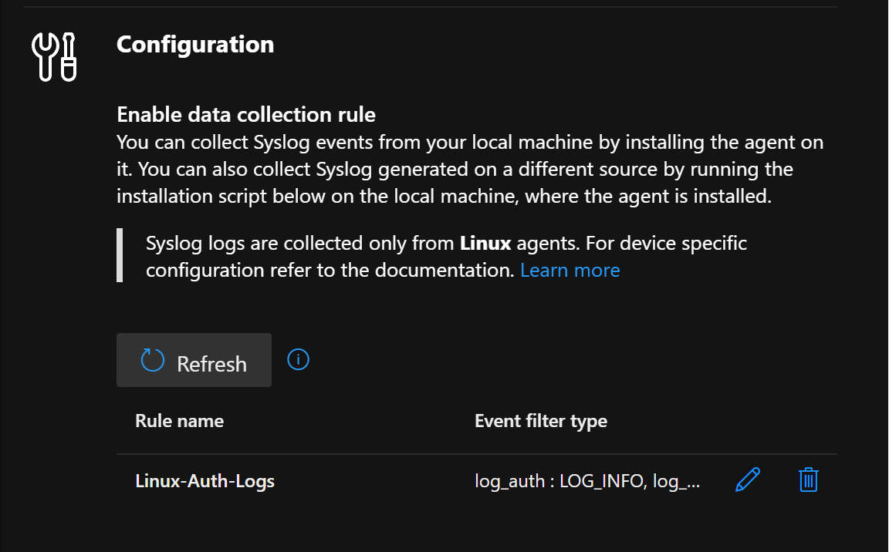
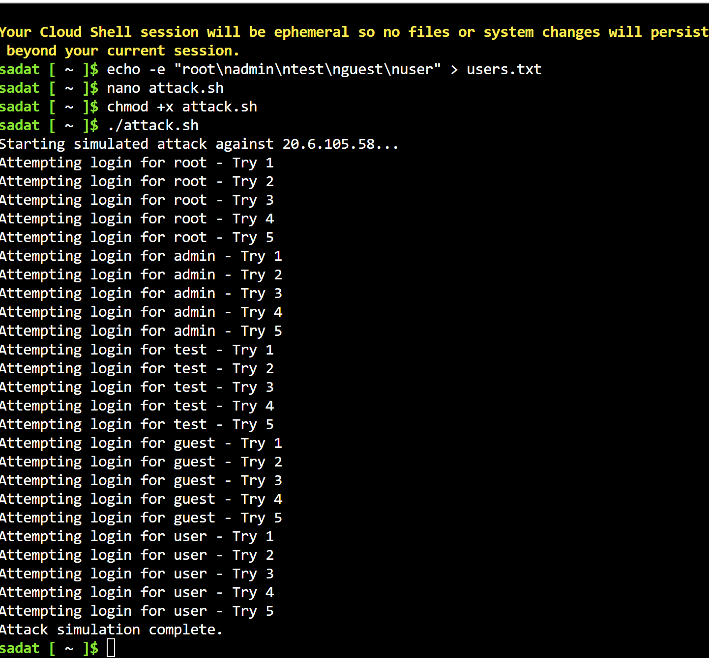
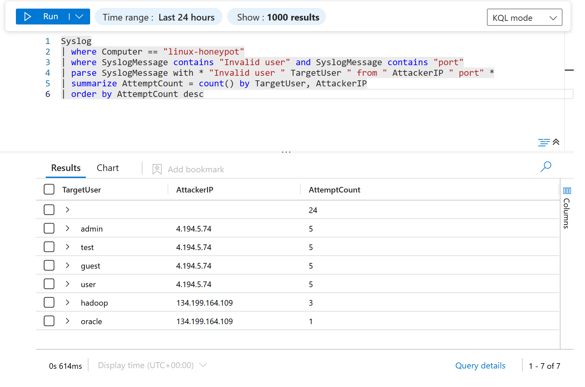
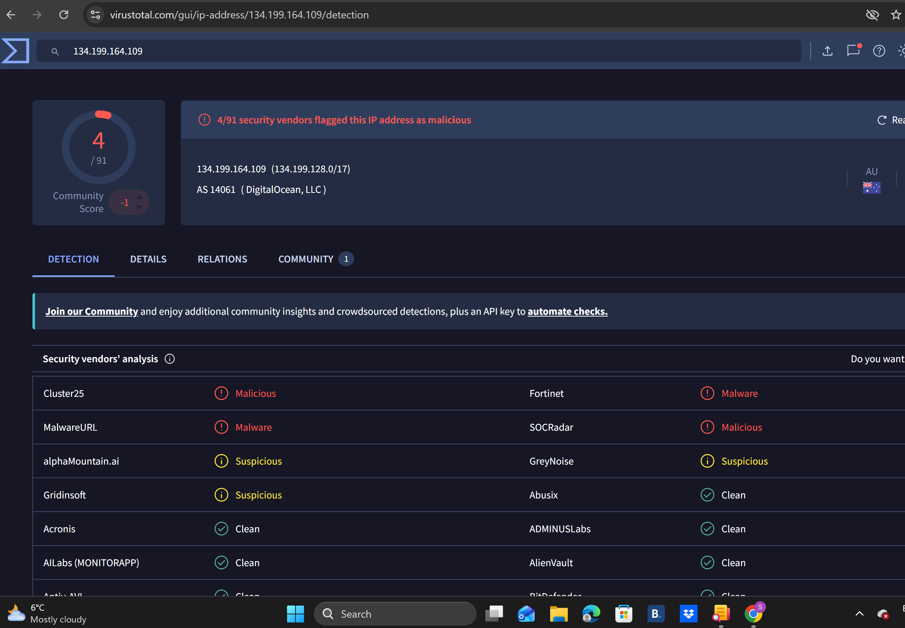

# Azure Sentinel SIEM & Linux Honeypot Lab

## Project Overview
Welcome to my cloud security lab! The objective of this project was to gain hands-on experience building a centralized log ingestion pipeline and performing threat-hunting analysis. 

I deployed an intentionally vulnerable Ubuntu virtual machine (`linux-honeypot`) in Microsoft Azure, exposed it to the internet, and monitored the resulting brute-force SSH attacks using Microsoft Sentinel and the Azure Monitor Agent (AMA).

---

## Log Ingestion Architecture

Before any attacks could be tracked, I needed to ensure the raw Linux security telemetry was being properly routed to my Sentinel Log Analytics workspace (`law-sentinel-lab`).

To achieve this, I configured a custom **Data Collection Rule (DCR)** named `Linux-Auth-Logs`. This rule explicitly targets the Linux system's authentication logs (`log_auth`), capturing login successes and failures, and forwards them directly to the Sentinel dashboard via the AMA.



---

## Simulating the Brute-Force Attack

To test the data pipeline, I used the Azure Cloud Shell to engineer a localized attack. I created a wordlist of common administrative accounts (`root`, `admin`, `test`, `guest`, `user`) and wrote a custom bash script (`attack.sh`). 

The script executed a high-velocity, looped SSH login simulation against the honeypot's public IP (`20.6.105.58`).



---

## Threat Hunting with Kusto Query Language (KQL)

Once the raw syslog data hit Sentinel, it was unstructured and noisy. To make the data actionable, I wrote a custom KQL query to filter the noise, parse the raw text blocks, and extract the specific attacker IPs and targeted usernames into a clean analytics table.

Here is the query I used:
 
```kql
Syslog
| where Computer == "linux-honeypot"
| where SyslogMessage contains "Invalid user" and SyslogMessage contains "port"
| parse SyslogMessage with * "Invalid user " TargetUser " from " AttackerIP " port" *
| summarize AttemptCount = count() by TargetUser, AttackerIP
| order by AttemptCount desc
```
Query Breakdown:
where filters: Isolated the logs to the specific honeypot machine and narrowed the data down to only the failed SSH login attempts.

parse operator: Instead of relying on clunky regular expressions, I used the parse operator to cleanly extract the TargetUser and AttackerIP dynamically out of the raw Syslog string.

summarize & order: Grouped the attacks by user and IP, counting the total attempts to show the velocity of the brute-force activity.

Results & Real-World Telemetry
The custom query successfully parsed the data stream. Not only did Sentinel perfectly track my simulated attack from my Cloud Shell IP (4.194.5.74), but the honeypot also captured actual external botnet traffic attempting to brute-force accounts like hadoop and oracle from an external IP (134.199.164.109).



The external IP address (134.199.164.109) that attempted to brute-force the honeypot was cross-referenced in VirusTotal and confirmed as a known malicious node associated with a DigitalOcean data center



Key Takeaways
Enterprise Infrastructure: Successfully architected an end-to-end cloud log pipeline utilizing Azure Monitor Agents and custom Data Collection Rules.

Detection Engineering: Demonstrated proficiency in using the KQL parse operator to transform unstructured system logs into actionable threat intelligence metrics.

Security Operations: Verified the functionality of the pipeline by executing custom bash scripts to generate live threat telemetry.
